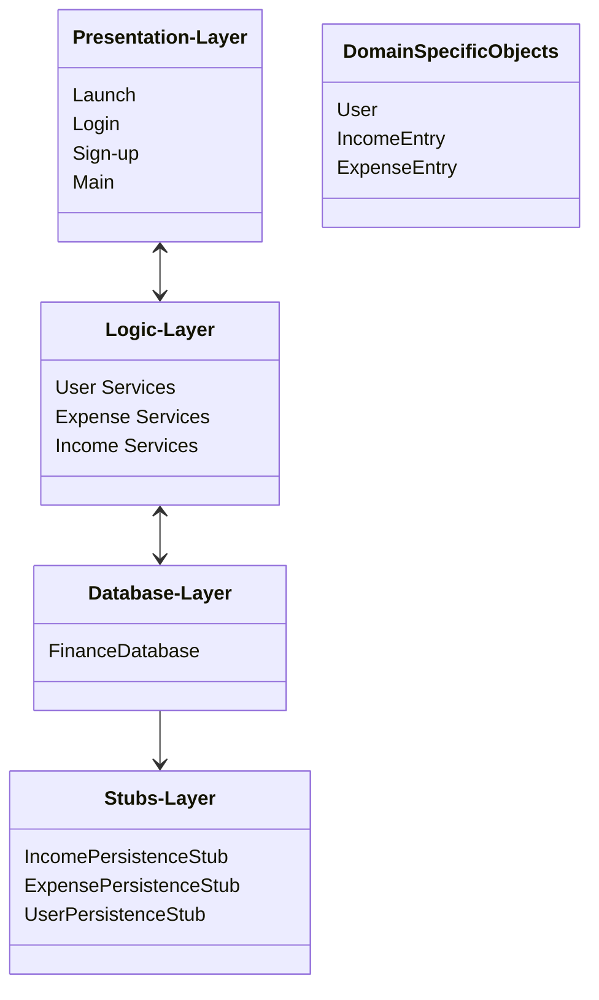

```mermaid
classDiagram
    Presentation-Layer <--> Logic-Layer
    Logic-Layer <--> Database-Layer
    Database-Layer --> Stubs-Layer

    class Presentation-Layer{
        Launch
        Login
        Sign-up
        Main
    } 
    Presentation-Layer
    class Logic-Layer{
        User Services
        Expense Services
        Income Services
    }
    Logic-Layer
    class Database-Layer{
        FinanceDatabase
    }
    Database-Layer
    class Stubs-Layer{
        IncomePersistenceStub
        ExpensePersistenceStub  
        UserPersistenceStub
    }
    Stubs-Layer
    class DomainSpecificObjects{
        User
        IncomeEntry
        ExpenseEntry
    }
    DomainSpecificObjects
```
  